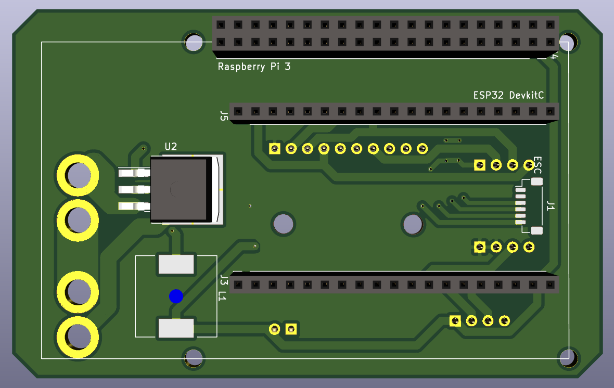

# LYNCS-Drone

## Todo
- [ ] ESP32とRaspberry Pi 3間でUARTを使えるようにする
- [x] ESP32でSPI(ESP32がmaster)を使えるようにする
- [ ] MPU9255から姿勢を取得する
- [x] DPS310から温度・気圧を取得する
- [ ] DPS310から高度を取得する
- [ ] 制御する

# Appearance
## 基板完成予想図

